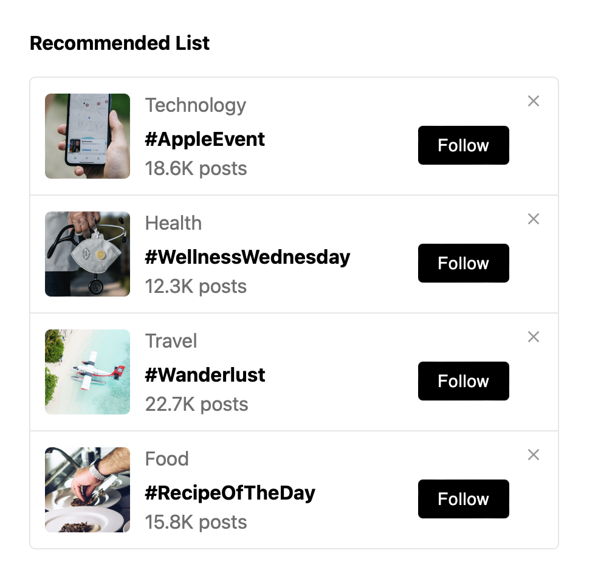

# react-vite-recommended-lists

## How to Install

The Recommended List App is a React application designed to display a list of items with interactive components. Each item is displayed in a card format, featuring a thumbnail image, a title, subtitle, and a button to perform an action. Users can also remove items from the list. This app showcases the use of React hooks, Material-UI components, and basic state management.

## How to Start Up

To get started with this project, follow these steps:

1. **Clone the Repository**:

   ```
   git clone https://github.com/KayviaHarriott/react-vite-recommended-lists.git
   ```

2. **Install Dependencies**:

   ```
   npm install
   ```

3. **Start the Development Server**:
   ```
   npm run dev
   ```
   This will start the development server and open the app in your default browser.

## Dependencies

This project relies on the following dependencies:

- **React**: A JavaScript library for building user interfaces.
- **Material-UI**: A popular React UI framework that provides pre-built components.
- **TypeScript** (if used): A superset of JavaScript that adds static typing.
- **@mui/material**: Material-UI core components.
- **@mui/icons-material**: Material-UI icons.

## Usage

1. **Run the Application**:
   After starting the development server, the application will be available at `http://localhost:5173`.

2. **Interact with the List**:

   - **items**: This is an array of items to be displayed. Each item should include properties like `subheading`, `title`, `subtitle`, and `thumbnail`. Example:
     ```tsx
     items={[
       {
         subheading: "Travel",
         title: "#Wanderlust",
         subtitle: "22.7K posts",
         thumbnail: "imgs/thumbnails/travel.png",
       },
     ]}
     ```

   - **buttonText**: The text displayed on the button for each item. Example:
     ```tsx
     buttonText="Follow"
     ```

   - **buttonAction**: A function to be executed when the button is clicked. Example:
     ```tsx
     buttonAction={() => console.log("Button clicked")}
     ```

   - **Remove Action**: Click the close icon to remove an item from the list.

   Here’s how you can use the `RecommendedList` component:

   ```tsx
   <RecommendedList
     items={[
       {
         subheading: "Travel", //string
         title: "#Wanderlust", //string
         subtitle: "22.7K posts", //string
         thumbnail: "imgs/thumbnails/travel.png", //string, location to image
       },
     ]}
     buttonText="Follow"
     buttonAction={() => console.log("Button clicked")}
   />
   ```


## Example

Here’s an example of how the component looks:


